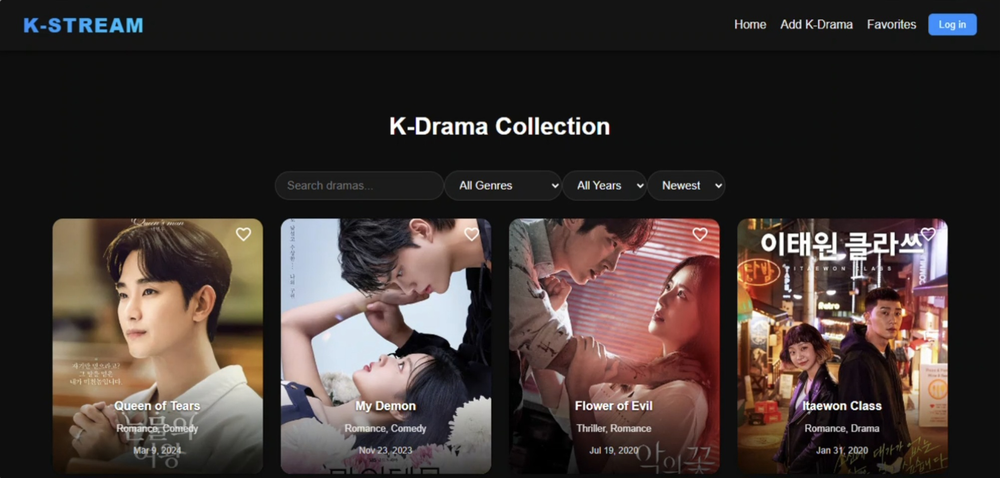
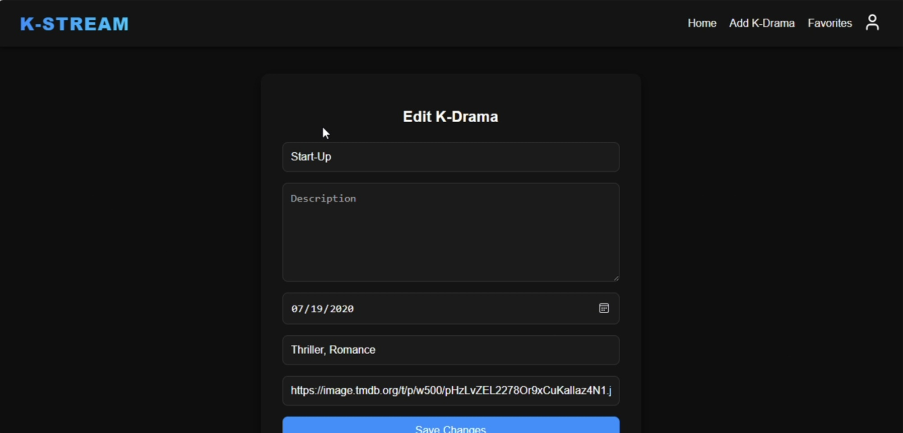
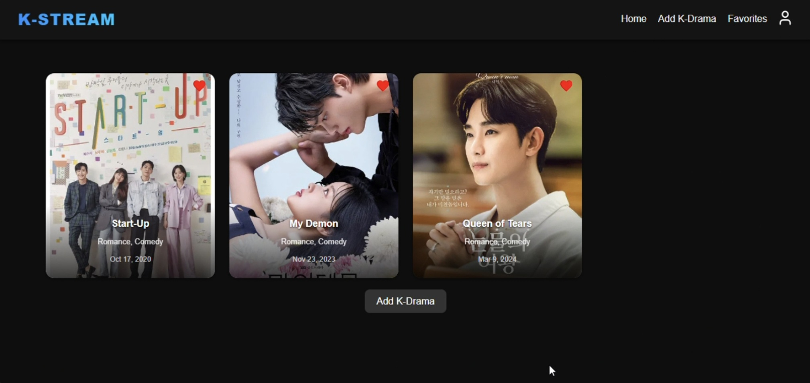
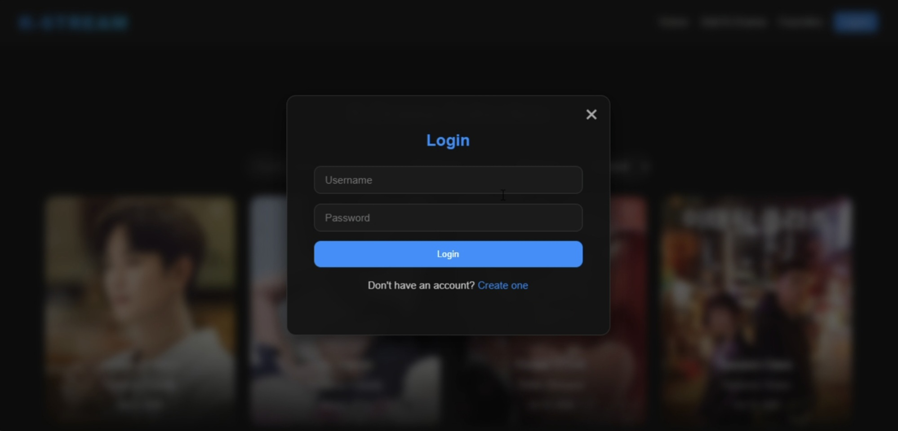

# K-STREAM

A full-stack web application built with React and Django REST Framework that allows users to add, favorite, and explore their favorite Korean dramas in one place.


## Features

* Add, edit, and delete K-Drama entries
* Favorite / unfavorite dramas
* Browse and search dramas by title or genre
* Display drama posters using TMDB API
* Clean, responsive UI built with React


## Tech Stack

**Frontend**

* React
* Axios
* MUI Icons

**Backend**

* Django
* Django REST Framework

**Database**

* SQLite

**External API**

* TMDB (The Movie Database)


## Screenshots






## Project Structure

```
react-dramas/   # React frontend
myapp/          # Django REST API backend
```

